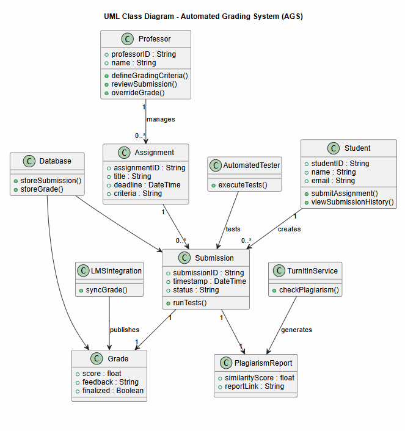
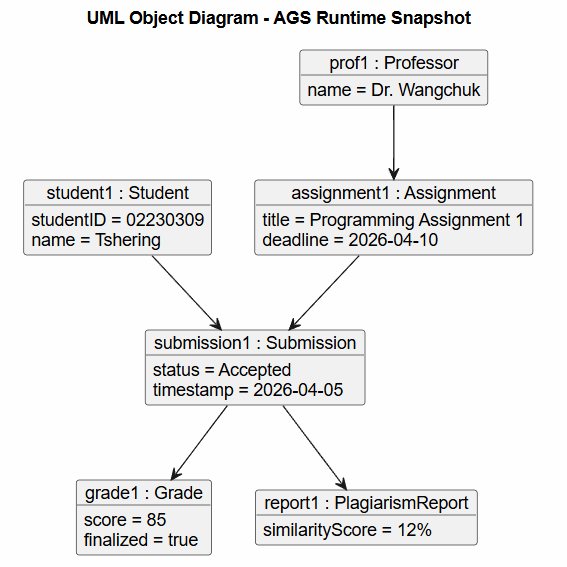

## 1. UML Class Diagram — Automated Grading System (AGS)

Shows system structure, classes, attributes, methods, and relationships.

The UML Class Diagram shows the structure of the Automated Grading System by presenting the main classes, their attributes, methods, and relationships. It explains how students submit assignments, professors manage grading criteria, and how submissions generate grades and plagiarism reports. The diagram also shows integration with automated testing, TurnItIn, and the University LMS while ensuring data is stored for auditing.

## 2. UML Object Diagram (Object Model)

Object diagram = real example snapshot of system at runtime.
It shows instances, not classes.

The UML Object Diagram represents a real time example of the system by showing actual objects and their values at a specific moment. It illustrates how a student submission is linked to an assignment, grade, and plagiarism report during execution. This diagram helps demonstrate how the system operates using real instances derived from the class diagram.
