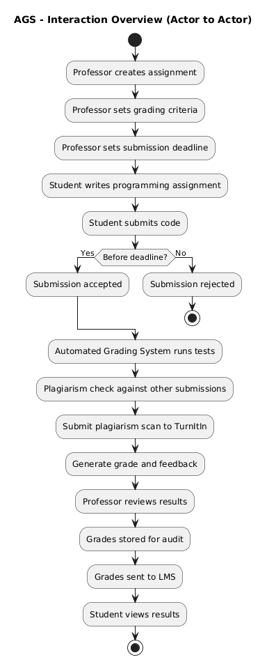

# Practical Report - Automated Grading System Design

## 1. Introduction

The Automated Grading System (AGS) is designed to automate the evaluation of programming assignments submitted by students. Currently, professors manually clone student repositories, execute the code locally, and inspect the results. This process is time-consuming and inefficient, especially with more than 300 students each year.

The proposed system will allow students to upload their source code directly into the system. The system will automatically run tests, check for plagiarism, calculate grades, and integrate with the university's Learning Management System (LMS). The results will also be stored for auditing purposes as required by the university regulations.

This report presents three UML diagrams that describe the system from different perspectives:

1. **Interaction Overview Diagram (IoD)** – Actor-to-Actor perspective (current manual process)
2. **Use Case Diagram (UCD)** – System functionality to support automated grading
3. **Interaction Overview Diagram (IoD)** – System-supported actor interactions (new automated process)

---

## 2. Interaction Overview Diagram (Actor-to-Actor Perspective)

