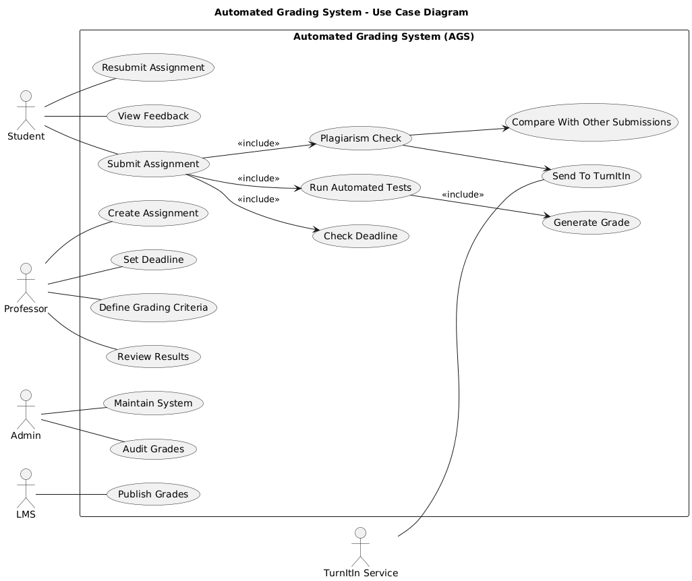

# Practical Report - Automated Grading System Design

## 1. Introduction

The Automated Grading System (AGS) is designed to automate the evaluation of programming assignments submitted by students. Currently, professors manually clone student repositories, execute the code locally, and inspect the results. This process is time-consuming and inefficient, especially with more than 300 students each year.

The proposed system will allow students to upload their source code directly into the system. The system will automatically run tests, check for plagiarism, calculate grades, and integrate with the university's Learning Management System (LMS). The results will also be stored for auditing purposes as required by the university regulations.

This report presents three UML diagrams that describe the system from different perspectives:

1. **Interaction Overview Diagram (IoD)** – Actor-to-Actor perspective (current manual process)
2. **Use Case Diagram (UCD)** – System functionality to support automated grading
3. **Interaction Overview Diagram (IoD)** – System-supported actor interactions (new automated process)

---
## 2. Interaction Overview Diagram (Actor-to-Actor Perspective)

The Interaction Overview Diagram describes the high-level workflow between actors involved in the grading process. The main actors include the student, professor, and external services such as plagiarism detection tools and the LMS.

The professor first creates an assignment, defines grading criteria, and sets the submission deadline. Students then develop their programs and submit their source code. The system runs automated tests, performs plagiarism detection, and generates a grade. The professor can review the results before they are recorded and sent to the LMS. Finally, students can view their grades and feedback.

## 3. Use Case Diagram (Functional View of the System)

The Use Case Diagram illustrates the functional requirements of the Automated Grading System and how external actors interact with the system. The primary actors include students and professors, while secondary actors include the LMS, TurnItIn plagiarism detection service, and system administrators.

Students can submit assignments, resubmit attempts, and view feedback. Professors can create assignments, define grading criteria, set deadlines, and review grading results. The system performs automated grading, plagiarism detection, and integrates with external services such as TurnItIn and the university LMS.

## 4. Interaction Overview Diagram (System Supported)

This diagram shows how actors interact with the Automated Grading System to achieve the final outcome of grading programming assignments. It highlights the role of the system in automating processes such as submission validation, test execution, plagiarism detection, grade calculation, and result distribution.

Students submit their code through the system, which validates the deadline and stores the submission. The system then runs automated tests, checks plagiarism by comparing submissions and using TurnItIn, and calculates grades. These results are stored for auditing purposes and shared with the LMS. Professors can review the results, and students can view their feedback.

## 5.Reflection 

This practical helped me understand how UML diagrams are used to design and visualize software systems before implementation. By creating the Interaction Overview Diagrams and the Use Case Diagram for the Automated Grading System, I learned how to identify different actors such as students, professors, administrators, and external services, and how they interact with the system to achieve a specific outcome.

The Interaction Overview Diagram helped me understand the overall workflow of the grading process, starting from assignment creation, student submission, automated testing, plagiarism detection, and finally grade publication. The Use Case Diagram helped define the functional requirements of the system and clearly show the system boundary and the services the system must provide.

Through this exercise, I also realized the importance of automation in large-scale academic environments where hundreds of students submit assignments. An automated grading system can significantly reduce manual work for professors, improve efficiency, and ensure fair and consistent evaluation through automated testing and plagiarism detection.

Overall, this practical improved my understanding of UML modeling and how different diagrams can be used together to analyze requirements and design a software architecture before development begins.

## 6.Conclusion

In conclusion, the Automated Grading System (AGS) provides an efficient solution for managing and evaluating programming assignments in a university environment. By automating tasks such as code submission, automated testing, plagiarism detection, and grade generation, the system reduces the workload of professors and improves the overall grading process.

Through the use of UML diagrams, including the Interaction Overview Diagrams and the Use Case Diagram, the system requirements and interactions between actors were clearly modeled. These diagrams helped visualize how students, professors, administrators, and external systems interact with the Automated Grading System to achieve the desired outcome.

Overall, this practical demonstrated how UML can be used as an effective tool for analyzing system requirements, designing system architecture, and improving communication among stakeholders during the early stages of software development.

## 7. AI Assistance Reference

https://chat.deepseek.com/a/chat/s/bdb62657-adc0-45ab-b99f-42edb2b59395